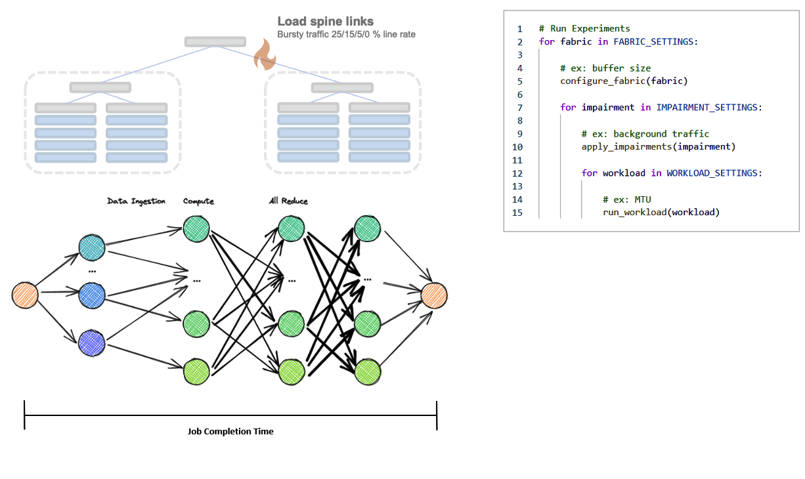

[](https://github.com/open-network-experiments/models/actions)

[DataModel](https://redocly.github.io/redoc/?url=https://raw.githubusercontent.com/open-network-experiments/models/main/docs/onexdatamodel_openapi.yaml)
| [Fabric API](https://redocly.github.io/redoc/?url=https://raw.githubusercontent.com/open-network-experiments/models/main/docs/onexfabric_openapi.yaml)
| [Dataflow API](https://redocly.github.io/redoc/?url=https://raw.githubusercontent.com/open-network-experiments/models/main/docs/onexdataflow_openapi.yaml)
# ONEx API and Data Models
This ONEx repository produces OpenAPI artifacts that describe APIs and Data Models neccessary for creating open network experiments.

# Fabric example

Here's a simple fabric example, creating a clos fabric with 1 spine, 2 pods and 1 ToR in each pod:

<p align="center">
    
</p>

Click on language/format node to expand the sample!

<details><summary>Json</summary>
<p>

```json
{
    "choice": "spine_pod_rack",
    "spine_pod_rack": {
        "spines": [
            {
                "count": 1
            }
        ],
        "pods": [
            {
                "count": 2,
                "pod_profile_name": [ "Pod Profile 1" ]
            }
        ],
        "pod_profiles": [
            {
                "name": "Pod Profile 1",
                "pod_switch": {
                    "count": 1
                },
                "rack": {
                    "count": 2,
                    "rack_profile_names": [ "Rack Profile 1" ]
                }
            }
        ],
        "rack_profiles": [
            {
                "name": "Rack Profile 1",
                "tor_to_pod_oversubscription": "2:1"
            }
        ]
    }
}
```
</p>
</details>

<details><summary>Yaml</summary>
<p>


```yaml
choice: spine_pod_rack
spine_pod_rack:
  spines:
  - count: 1
  pods:
  - count: 2
    pod_profile_name:
    - Pod Profile 1
  pod_profiles:
  - name: Pod Profile 1
    pod_switch:
      count: 1
    rack:
      count: 2
      rack_profile_names:
      - Rack Profile 1
  rack_profiles:
  - name: Rack Profile 1
    tor_to_pod_oversubscription: '2:1'
```
</p>
</details>


<details><summary>Python</summary>
<p>

```python
def fabric_sample():
    config = onex.api().config()
    config.fabric.spine_pod_rack.spines.add(count=1)
    config.fabric.spine_pod_rack.pods.add(
        count=2,
        pod_profile_name=["Pod Profile 1"]
    )

    pod_profile = config.fabric.spine_pod_rack.pod_profiles.add(name="Pod Profile 1")
    pod_profile.pod_switch.count = 1
    rack_profile = config.fabric.spine_pod_rack.rack_profiles.add(
        name="Rack Profile 1",
        tor_to_pod_oversubscription="2:1"
    )
    pod_profile.rack.rack_profile_names = [ rack_profile.name ]
    pod_profile.rack.count = 2
```
</p>
</details>


# Dataflow example

Below is a simple scatter-gather dataflow example:

<p align="center">
    
</p>

<details><summary>Json</summary>
<p>

```json
{
    "dataflow": {
        "flow_profiles": [
            {
                "name": "data transfer",
                "data_size": 1073741824
            }
        ],
        "workload": [
            {
                "name": "Scatter",
                "choice": "scatter",
                "scatter": {
                    "destinations": [
                        "Compute 1",
                        "Compute 2"
                    ],
                    "flow_profile_name": "data transfer",
                    "sources": [
                        "Aggregator"
                    ]
                }
            },
            {
                "name": "Gather",
                "choice": "gather",
                "gather": {
                    "destinations": [
                        "Aggregator"
                    ],
                    "flow_profile_name": "data transfer",
                    "sources": [
                        "Compute 1",
                        "Compute 2"
                    ]
                }
            }
        ]
    },
    "hosts": [
        {
            "name": "Aggregator",
            "address": "1.1.1.1"
        },
        {
            "name": "Compute 1",
            "address": "3.3.3.3"
        },
        {
            "name": "Compute 2",
            "address": "4.4.4.4"
        }
    ]
}
```
</p>
</details>

<details><summary>Yaml</summary>
<p>


```yaml
dataflow:
  flow_profiles:
  - name: data transfer
    data_size: 1073741824
  workload:
  - name: Scatter
    choice: scatter
    scatter:
      destinations:
      - Compute 1
      - Compute 2
      flow_profile_name: data transfer
      sources:
      - Aggregator
  - name: Gather
    choice: gather
    gather:
      destinations:
      - Aggregator
      flow_profile_name: data transfer
      sources:
      - Compute 1
      - Compute 2
hosts:
- name: Aggregator
  address: 1.1.1.1
- name: Compute 1
  address: 3.3.3.3
- name: Compute 2
  address: 4.4.4.4
```
</p>
</details>


<details><summary>Python</summary>
<p>

```python
def dataflow_sample():
    api = onex.api()
    config = api.config()
    aggregator = config.hosts.add(name="Aggregator", address="1.1.1.1")    
    compute1 = config.hosts.add(name="Compute 1", address="3.3.3.3")
    compute2 = config.hosts.add(name="Compute 2", address="4.4.4.4")
    data_transfer = config.dataflow.flow_profiles.add(name='data transfer', data_size=1*1024*1024*1024)
    
    scatter = config.dataflow.workload.add(name="Scatter").scatter
    scatter.sources = [ aggregator.name ]
    scatter.destinations = [ compute1.name, compute2.name ]
    scatter.flow_profile_name = data_transfer.name

    gather = config.dataflow.workload.add(name="Gather").gather
    gather.sources = [ compute1.name, compute2.name ]
    gather.destinations = [ aggregator.name ]
    gather.flow_profile_name = data_transfer.name 

    api.set_config(config)
    api.run_experiment(api.experiment_request())
    jct = api.get_metrics(api.metrics_request()).jct
    print (f"Experiment complete, JCT: {jct}")
 ```
</p>
</details>

# System Experiment example

This example showcase running an ML training job over a simple fabric with different fabric buffer and transport settings while also running an background traffic to put pressure on links up to the spine

<p align="center">
    
</p>

<details><summary>Python</summary>
<p>

```python
def configure_fabric(buffer):
    # Objective: Configure a fabric with 1 spine, 2 pods, 2 ToRs pe pod and set a buffer in each port int he pod switch

    api = onex.api()
    config = api.config()

    # Create a qos profile with the buffer settings
    qos_profile = config.fabric.qos_profiles.add(name='restricted ingress admission')
    qos_profile.ingress_admission.shared_buffer_bytes = 0
    qos_profile.ingress_admission.reserved_buffer_bytes = buffer

    # Create the topology and assign the qos profile to pod switches
    config.fabric.spine_pod_rack.spines.add(count=1)
    config.fabric.spine_pod_rack.pods.add(
        count=2,
        pod_profile_name=["Pod Profile 1"]
    )

    pod_profile = config.fabric.spine_pod_rack.pod_profiles.add(name="Pod Profile 1")
    pod_profile.pod_switch.count = 1
    rack_profile = config.fabric.spine_pod_rack.rack_profiles.add(
        name="Rack Profile 1",
        tor_to_pod_oversubscription="2:1"
    )
    pod_profile.rack.rack_profile_names = [ rack_profile.name ]
    pod_profile.rack.count = 2
    pod_profile.pod_switch.qos_profile_name = qos_profile.name

    # Apply the fabric config
    api.set_config(config)


def apply_impairments(spine_link_load):
    # Objective: Inject a background traffic in the spine links to create congestion while running traffic from external hosts
    
    api = onex.api()
    config = api.get_config()

    # Create the flow and injecting in the pod switch of the 1st pod
    flow1 = config.chaos.background_traffic.flows.add(name="Flow 1")
    flow1.fabric_entry_point.switch_reference.pod.pod_index = 1
    flow1.fabric_entry_point.switch_reference.pod.switch_index = 1
    
    stateless_flow = flow1.stateless.add(name='Load Spine')
    stateless_flow.rate = spine_link_load
    stateless_flow.rate_unit = 'Gbps'

    # Update fabric config with background traffic
    api.set_config(config)


def run_workfload(mtu):
    # Objective: Create a ML Training data flow, run and print the Job Completion Time

    api = onex.api()
    config = onex.api().config()

    storage_host = config.hosts.add(name="Data Storage 1", address="1.1.1.1")
    compute1 = config.hosts.add(name="Compute 1", address="3.3.3.3")
    compute2 = config.hosts.add(name="Compute 2", address="4.4.4.4")

    hyperparameters = config.dataflow.flow_profiles.add(name='hyperparameters', data_size=10000)
    image_data = config.dataflow.flow_profiles.add(name='image data', data_size=10000000)
    gradients_exchange = config.dataflow.flow_profiles.add(name='receive and update gradients', data_size=1000000)
        
    init_scatter = config.dataflow.workload.add(name="transfer hyperparameters").scatter
    init_scatter.sources = [ storage_host.name ]
    init_scatter.destinations = [ compute1.name, compute2.name ]
    init_scatter.flow_profile_name = hyperparameters.name

    epoch_loop = config.dataflow.workload.add(name="Epoch loop").loop
    epoch_loop.iterations = 10

    batch_scatter = epoch_loop.children.add(name='Transfer images').scatter
    batch_scatter.sources = [ storage_host.name ]
    batch_scatter.destinations = [ compute1.name, compute2.name ]
    batch_scatter.flow_profile_name = image_data.name

    batch_compute = epoch_loop.children.add(name='Calculate gradients').compute
    batch_compute.nodes = [ compute1.name, compute2.name ]
    batch_compute.simulated.duration = 10

    batch_all_reduce = epoch_loop.children.add(name='Exchange gradients').all_reduce
    batch_all_reduce.nodes = [ compute1.name, compute2.name ]
    batch_all_reduce.flow_profile_name = gradients_exchange.name
    batch_all_reduce.type = batch_all_reduce.RING

    back_compute_optimizer = epoch_loop.children.add(name='Compute optimizer function + update model').compute
    back_compute_optimizer.nodes = [ compute1.name, compute2.name ]
    back_compute_optimizer.simulated.duration = 10

    # Set the MTU
    hyperparameters.ethernet.mtu = mtu
    image_data.ethernet.mtu = mtu
    gradients_exchange.ethernet.mtu = mtu

    # Apply data flow config
    api.set_config(config)

    # Run the workfload and print out Job Completion Time
    api.run_experiment(api.experiment_request())
    jct = api.get_metrics(api.metrics_request()).jct
    print (f"Experiment complete, JCT: {jct}")


def run_experiments():

    for fabric_switch_port_buffer in [0, 10000, 1000000]:

        configure_fabric(fabric_switch_port_buffer)

        for spine_link_load in [0, 10, 20]:

            apply_impairments(spine_link_load)

            for mtu in [1500, 9000]:

                run_workfload(mtu)

 ```
</p>
</details>

# Contributing

The open-network-experiment organization welcomes new members to join this open source community project and contribute to its development.